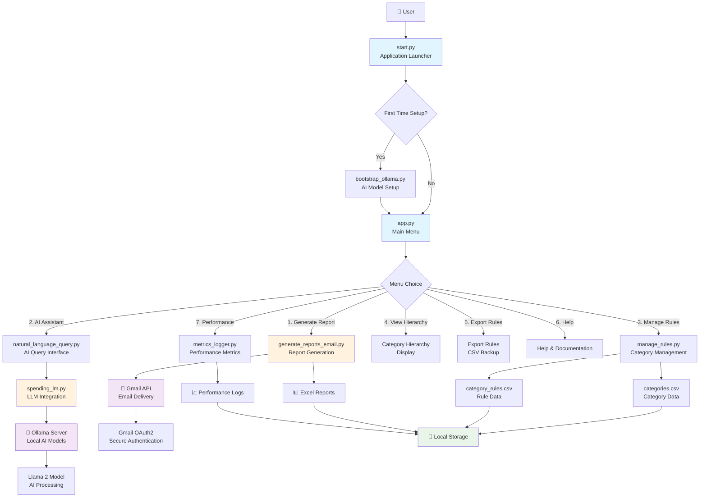

# Hybrid Deterministic AI for Financial Systems

[](https://doi.org/10.5281/zenodo.18700876)

# 💰 Spending Report & Analysis System

A comprehensive personal finance management application with AI-powered insights, automated report generation, and secure email delivery. Built with Python and featuring local LLM integration for intelligent spending analysis.

## ✨ Features

- 📊 **Automated Report Generation** - Process CSV/PDF bank statements into Excel reports
- 🤖 **AI-Powered Analysis** - Local LLM queries for spending insights and recommendations
- 📧 **Secure Email Delivery** - Gmail OAuth2 integration (no passwords stored)
- 📈 **Category Management** - Customizable spending categories and rules
- 📊 **Performance Metrics** - Track system usage and AI inference statistics
- 🔒 **Privacy-First** - All processing done locally, no data sent to external servers
- 🖥️ **Cross-Platform** - Works on Windows, macOS, and Linux

## � Screenshots & Visual Guide

### First-Time Setup
  
*Figure 1: Initial application startup showing the progress bar and first-time setup prompts*

### Main Menu Interface
  
*Figure 2: Main application menu with all available options*

### AI Model Installation Prompt
  
*Figure 3: Interactive prompt for installing AI models when Ollama is detected but models are missing*

### Report Generation Process
  
*Figure 4: Excel report generation from CSV bank statements*

### AI Query Interface
  
*Figure 5: Natural language query interface for spending analysis*

### Gmail OAuth Setup
  
*Figure 6: Secure OAuth2 authentication flow for email integration*

### System Architecture
  
*Figure 7: Complete system architecture showing component interactions and data flow*

## 🏗️ Architecture Overview



### Component Descriptions

- **🏗️ Core Components**:
  - `start.py`: Application entry point with setup and configuration
  - `app.py`: Main menu interface and user interaction
  - `bootstrap_ollama.py`: AI model installation and setup

- **📊 Data Processing**:
  - `generate_reports_email.py`: CSV processing and Excel report generation
  - `manage_rules.py`: Category and rule management
  - `metrics_logger.py`: Performance tracking and analytics

- **🤖 AI Integration**:
  - `spending_lm.py`: Local LLM interface for financial analysis
  - `natural_language_query.py`: User query processing and responses

- **🔐 Security & Auth**:
  - `gmail_auth.py`: OAuth2 authentication for Gmail integration
  - `setup_oauth.py`: OAuth credential management

- **📁 Data Storage**:
  - `categories.csv`: Spending category definitions
  - `category_rules.csv`: Automatic categorization rules
  - Excel reports: Generated analysis reports

- **🔗 External Dependencies**:
  - **Ollama**: Local LLM server for AI processing
  - **Gmail API**: Secure email delivery
  - **OAuth2**: Token-based authentication

### Data Flow

1. **Setup Phase**: User launches app → First-time setup → AI model installation
2. **Main Operation**: Menu selection → Component execution → Data processing
3. **AI Processing**: Query → LLM integration → Local AI analysis → Response
4. **Report Generation**: CSV input → Processing → Excel output → Email delivery
5. **Configuration**: Category/rule management → CSV storage → Future use

### Security Architecture

- **Local-First**: All data processing happens on user's machine
- **OAuth2**: Secure token-based authentication (no password storage)
- **No External Data**: Financial data never leaves the local environment
- **Credential Protection**: Sensitive files excluded from version control
## �🚀 Quick Start
> 📸 **Visual Guide Available**: See the [Screenshots section](#-screenshots--visual-guide) below for step-by-step visual instructions.
### Option 1: Pre-built Executable (Easiest)

**For End Users:**
1. Download the appropriate executable for your platform from [Releases](../../releases)
2. Extract the zip file
3. Double-click the executable (`budgetapp` on macOS/Linux, `budgetapp.exe` on Windows)
4. No installation required!

### Option 2: Run from Source

**Prerequisites:**
- Python 3.7+
- Ollama (for AI features)

**Setup:**
```bash
# Clone the repository
git clone https://github.com/sitarammani/report.git
cd report

# Create virtual environment
python -m venv .venv
source .venv/bin/activate  # On Windows: .venv\Scripts\activate

# Install dependencies
pip install -r requirements.txt

# Run the application
python start.py
```

## 📋 Main Menu Options

1. **📊 Generate Spending Report** - Create Excel reports from bank statements
2. **🤖 AI Assistant & Analysis** - Natural language queries about spending
3. **⚙️ Manage Categories & Rules** - Customize categorization
4. **📈 View Category Hierarchy** - See category relationships
5. **📤 Export Custom Rules** - Backup your customizations
6. **ℹ️ Help & Documentation** - View guides
7. **📈 Performance Summary** - View system metrics

## 🔧 Building from Source

### Automated Builds (GitHub Actions)
The repository includes automated cross-platform builds. Push to `main` branch to trigger builds for Windows, macOS, and Linux.

### Manual Build
```bash
# Install PyInstaller
pip install pyinstaller

# Build the application
pyinstaller --clean budgetapp.spec

# Find the executable in dist/budgetapp/
```

## 📧 Gmail Integration Setup

The application uses Gmail OAuth2 for secure email delivery.

### Automatic Setup (Recommended)
The application includes bundled OAuth credentials. Simply run the app and follow the prompts.

### Manual Setup (If Needed)
1. Go to [Google Cloud Console](https://console.cloud.google.com/)
2. Create/select a project
3. Enable Gmail API
4. Create OAuth 2.0 credentials (Desktop application)
5. Download `credentials.json`
6. Place in the application directory

## 🤖 AI Features Setup

The app uses Ollama for local AI processing:

```bash
# Install Ollama
# macOS: brew install ollama
# Windows/Linux: Download from https://ollama.ai

# Start Ollama service
ollama serve

# Pull the required model (done automatically by the app)
ollama pull llama2
```

## 📊 Data Files

- `categories.csv` - Spending category definitions
- `category_rules.csv` - Automatic categorization rules
- Sample report: `Spending_Report_01_2026.xlsx`

## 🔒 Security & Privacy

- **No data sent externally** - All processing is local
- **OAuth2 authentication** - Secure token-based email access
- **Local LLM** - AI processing without cloud dependency
- **Credential protection** - Sensitive files excluded from version control

## 🛠️ Development

### Project Structure
```
├── start.py              # Application launcher
├── app.py                # Main menu interface
├── spending_lm.py        # LLM integration
├── generate_reports_email.py  # Report generation
├── natural_language_query.py  # AI query interface
├── manage_rules.py       # Category/rule management
├── gmail_auth.py         # Email authentication
├── screenshots/          # Visual documentation (see screenshots/README.md)
├── categories.csv        # Category data
├── category_rules.csv    # Rule data
└── requirements.txt      # Python dependencies
```

### Contributing
1. Fork the repository
2. Create a feature branch
3. Make your changes
4. Test thoroughly
5. Submit a pull request

## 📋 Requirements

- Python 3.7+
- Ollama (for AI features)
- Gmail account (for email features)
- 4GB+ RAM recommended

## 📄 License

This project is open source. See individual files for license information.

## 🆘 Troubleshooting

**App won't start:**
- Ensure Python 3.7+ is installed
- Check that all dependencies are installed
- Verify Ollama is running (if using AI features)

**Email not working:**
- Run the app and complete OAuth setup
- Check that `token.json` exists
- Verify Gmail API is enabled

**AI features not working:**
- Install and start Ollama
- Ensure the Llama 2 model is downloaded
- Check Ollama service status

---

**Built with ❤️ for personal finance management**

## Citation

Sitaram Mani (2026). BudgetApp [Software]. Zenodo. https://doi.org/10.5281/zenodo.1234567

